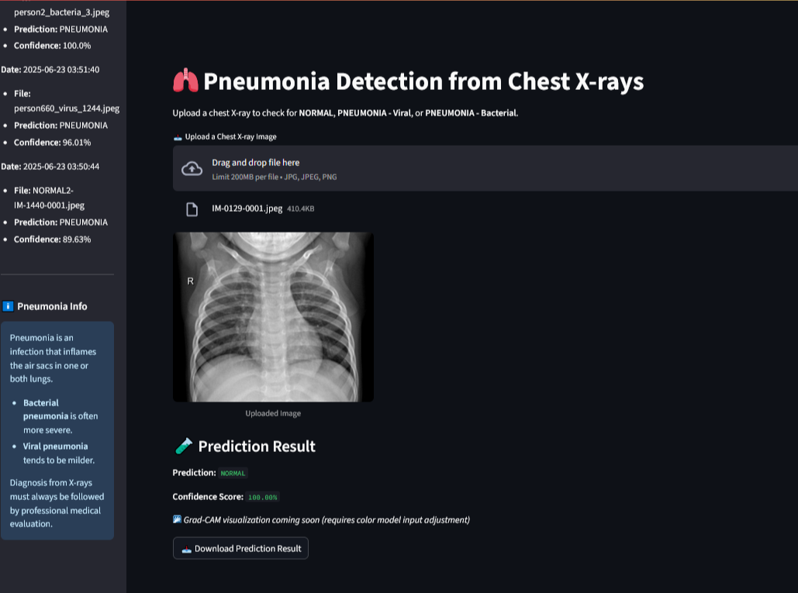
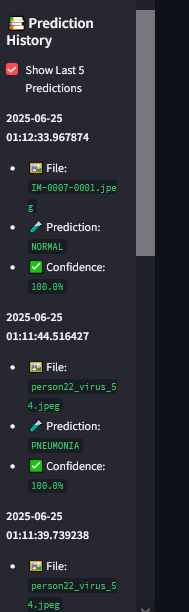
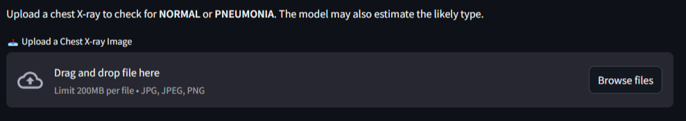
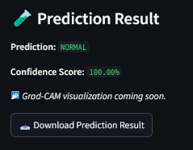
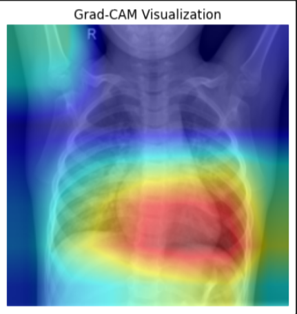

# 🫁 Pneumonia X-ray Detector

A deep learning web application that detects pneumonia from chest X-ray images using a custom-trained PyTorch model with a user-friendly Streamlit interface.

!
 

---

## 🚀 Features

- 🔍 Upload chest X-ray images for instant classification
- 🤖 Detects **NORMAL** and **PNEUMONIA**
- 🦠 Differentiates between **Bacterial** and **Viral** pneumonia (based on confidence)
- 📊 Displays confidence score
- 📁 Download prediction results
- 🕓 View recent prediction history
- 🧠 Grad-CAM (Coming Soon)
- 💾 SQLite database support for prediction logging

---

## 📂 Folder Structure

```
pneumonia-xray-detector/
├── app/
│   ├── app.py               # Main Streamlit app
│   └── utils.py             # DB utility functions
├── data/
│   └── pneumonia_model.pth  # Trained PyTorch model
├── database/
│   └── predictions.db       # Auto-generated SQLite database
├── notebooks/
│   └── EDA_and_Visualizations.ipynb
├── src/
│   ├── dataset.py           # Data preprocessing
│   ├── model.py             # ResNet18 model loader
│   ├── train.py             # Training script
│   └── evaluate.py          # Model evaluation
├── screenshots/
│   └── demo.png             # 📸 Replace with actual screenshots
├── requirements.txt         # Project dependencies
├── README.md                # You're here
└── .gitignore
```

---

## 🖥️ Setup Instructions

### 1. Clone the Repo

```bash
git clone https://github.com/licht005/pneumonia-xray-detector.git
cd pneumonia-xray-detector
```


### 2. Create a Virtual Environment (Optional but Recommended)

```bash
python -m venv venv
venv\Scripts\activate  # Windows
source venv/bin/activate  # macOS/Linux
```

### 3. Install Dependencies

```bash
pip install -r requirements.txt
```

### 4. Run the App

```bash
streamlit run app/app.py
```

---

## 🧠 Model Info

- Trained on grayscale chest X-ray images.
- Custom ResNet18 architecture adapted for 1-channel inputs.
- Weighted loss to handle class imbalance.
- Achieved high accuracy and recall on pneumonia class.
- Grad-CAM visualization support in progress.

---

## 🗃️ Database

Predictions are automatically logged in a local SQLite database (`database/predictions.db`) with timestamps and metadata. Future versions can integrate cloud-based storage.

---

## 📸 Screenshots

### Main Interface



### upload section



### Prediction



### Grad Cam




---

## 📩 Contact

- 👤 GitHub: [licht005](https://github.com/licht005)
- 📧 Email: lucaskpatah8@gmail.com

---
##Visit the webpage
```bash
https://pneumonia-xray-detector-licht005.streamlit.app
```

## 🛡️ Disclaimer

This application is for educational and research purposes only. It is **not a diagnostic tool** and should not replace professional medical advice.

---

## 📃 License

MIT License. See `LICENSE` file for details.
